<h1>Project overview</h1>

This project is a full-stack Calculator Web Application developed using Python, HTML, CSS, JavaScript, and MySQL. The application is integrated with a complete DevOps CI/CD pipeline using GitHub, Jenkins, Docker, Docker Hub, Kubernetes, and Argo CD.

Whenever the developer pushes code to GitHub, a webhook automatically triggers the Jenkins pipeline to build, test, and containerize the application. Docker images are pushed to Docker Hub, and Kubernetes deployments are managed through Argo CD using the GitOps approach.

The pipeline also sends automated email notifications for successful or failed builds and deployments.

<h2>Architecture</h2>

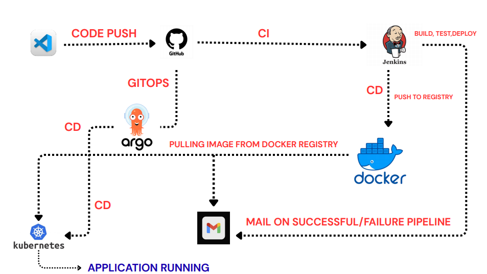

<h2>Tech stack</h2>

<table>
<tr><th>Category</th><th>Technology</th></tr>
<tr><td>Frontend</td><td>HTML, CSS, JavaScript</td></tr>
<tr><td>Backend</td><td>Python</td></tr>
<tr><td>Database</td><td>MySQL</td></tr>
<tr><td>CI/CD</td><td>Jenkins</td></tr>
<tr><td>Version Control</td><td>GitHub</td></tr>
<tr><td>Containerization</td><td>Docker</td></tr>
<tr><td>Container Registry</td><td>Docker Hub</td></tr>
<tr><td>Orchestration</td><td>Kubernetes</td></tr>
<tr><td>GitOps</td><td>Argo CD</td></tr>
<tr><td>Notifications</td><td>Email Extension Plugin</td></tr>
</table>

<h2>Project structure</h2>

<pre>
project/

├── backend/
│   ├── app.py
│   ├── requirements.txt
│   └── Dockerfile

├── frontend/
│   ├── index.html
│   ├── style.css
│   ├── script.js
│   └── Dockerfile

├── mysql/
│   └── init.sql

├── kubernetes/
│   ├── mysql-pv.yaml
│   ├── mysql-pvc.yaml
│   ├── mysql-configmap.yaml
│   ├── mysql-secrets.yaml
│   ├── mysql-deployment.yaml
│   ├── mysql-service.yaml
│   ├── backend-deployment.yaml
│   ├── backend-service.yaml
│   ├── frontend-deployment.yaml
│   ├── frontend-service.yaml

├── Jenkinsfile
├── docker-compose.yml
└── README.md
</pre>

<h2>Local Setup</h2>

<h3>Jenkins Setup</h3>

Jenkins is started locally to manage CI/CD pipelines. It handles code checkout from GitHub, builds the application, runs tests, creates Docker images, and triggers deployment workflows.

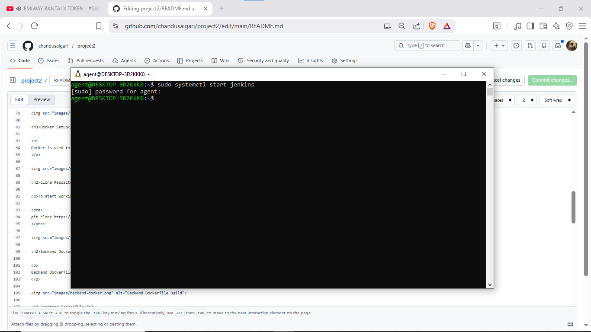

<h3>Docker Setup</h3>

Docker is used to containerize backend, frontend, and database services. After installation, the Docker daemon is started to build, run, and manage containers locally before pushing images to Docker Hub.

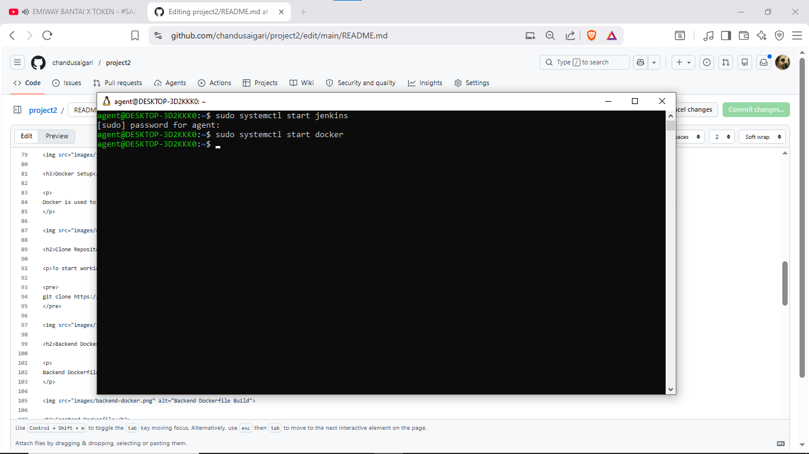

<h2>Clone Repository</h2>

To start working with the project locally, clone the source code from GitHub:

<pre>
git clone https://github.com/chandusaigari/project2.git
</pre>

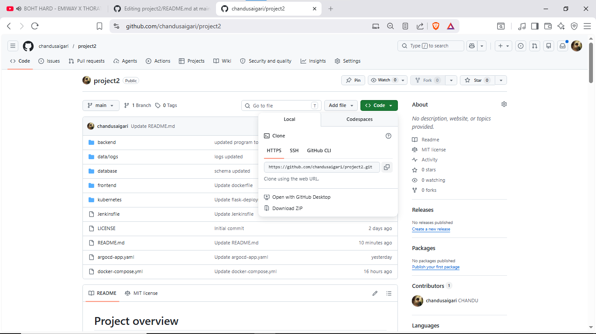

<h2>Backend Dockerfile</h2>

Backend Dockerfile is used to containerize the Python application. It installs required dependencies and runs the backend server inside a Docker container.

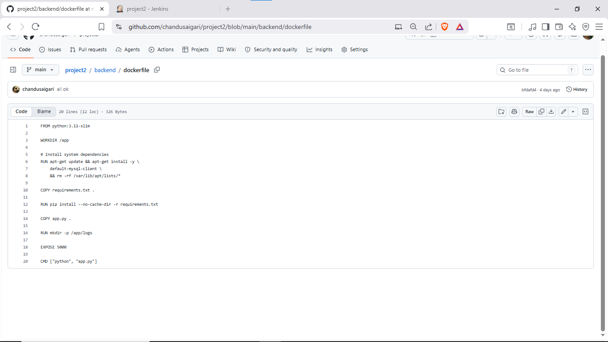

<h2>Frontend Dockerfile</h2>

Frontend Dockerfile is used to containerize the static web application. It serves HTML, CSS, and JavaScript files using an Nginx web server inside a container.

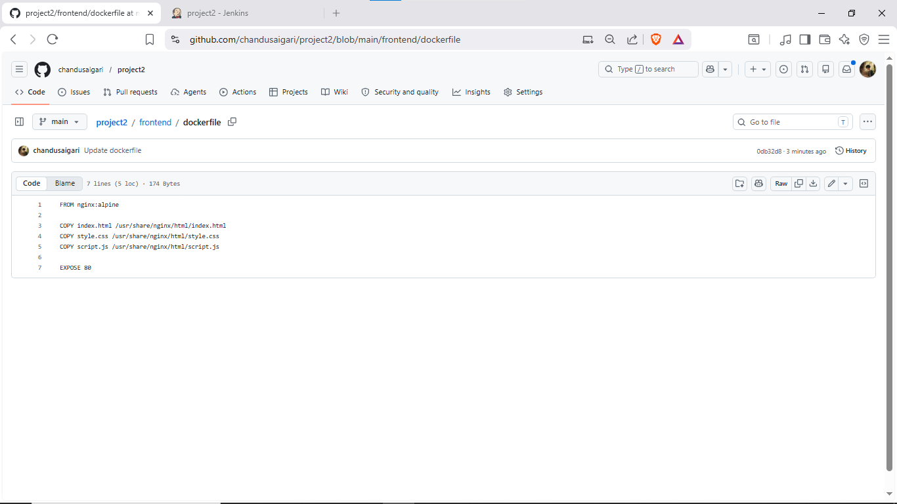

<h2>Jenkinsfile (CI/CD Pipeline)</h2>

Jenkinsfile defines the complete CI/CD pipeline. It automates code checkout from GitHub, builds the application, runs tests, creates Docker images, pushes them to Docker Hub, and triggers deployment to Kubernetes via Argo CD. It also sends email notifications for success or failure.

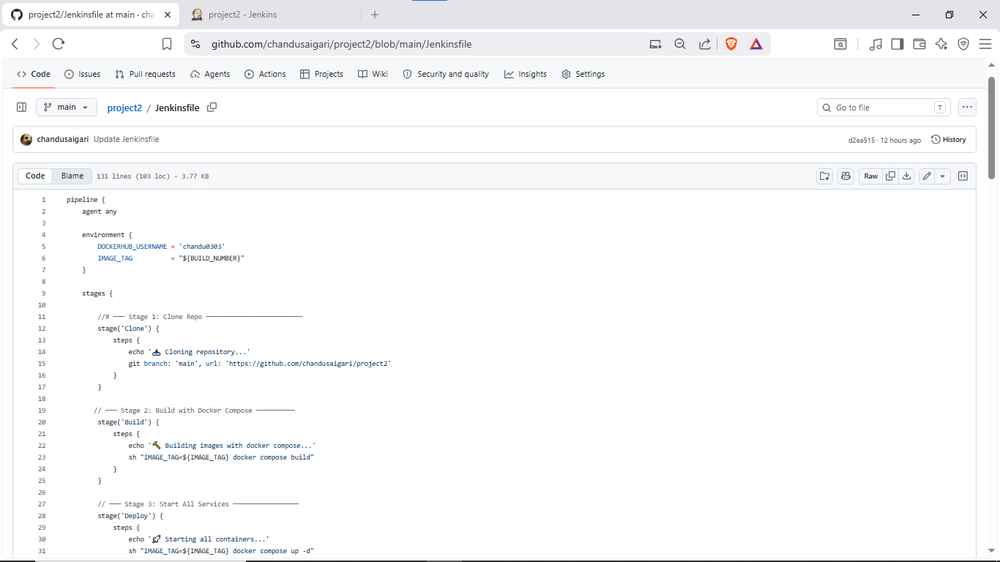

<h2>Docker Compose (Multi-Container Setup)</h2>

Docker Compose is used to run the full application locally with multiple containers (frontend, backend, MySQL) using a single command. It also manages shared network and persistent volume for MySQL data.

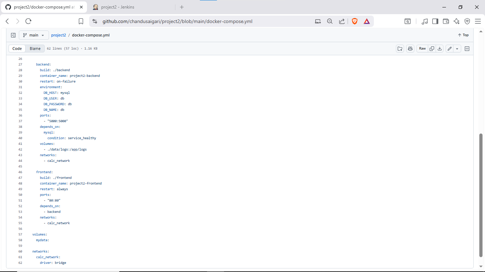

<h2>Kubernetes Deployment (Complete Setup)</h2>

Kubernetes is used to deploy and manage the multi-container application (frontend, backend, MySQL). It ensures scalability, high availability, and service communication inside the cluster.

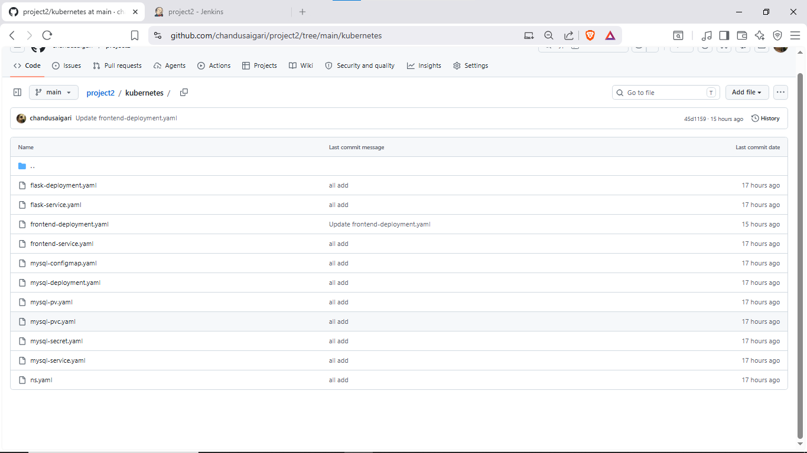

<h2>Argo CD Application (GitOps CD)</h2>

This manifest defines the Argo CD application that continuously syncs Kubernetes manifests from GitHub and deploys updated Docker images pulled from the container registry.

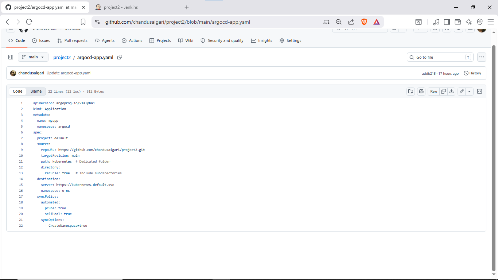

<h2>GitHub Webhook</h2>

GitHub Webhook triggers Jenkins automatically whenever code is pushed or any change is made in the repository. This starts the CI/CD pipeline without manual intervention.

<h2>Email Notifications</h2>

After every Jenkins pipeline run, an email notification is sent automatically based on the result.
If the build and deployment are successful, a success email is sent. If any stage fails, a failure email is sent.

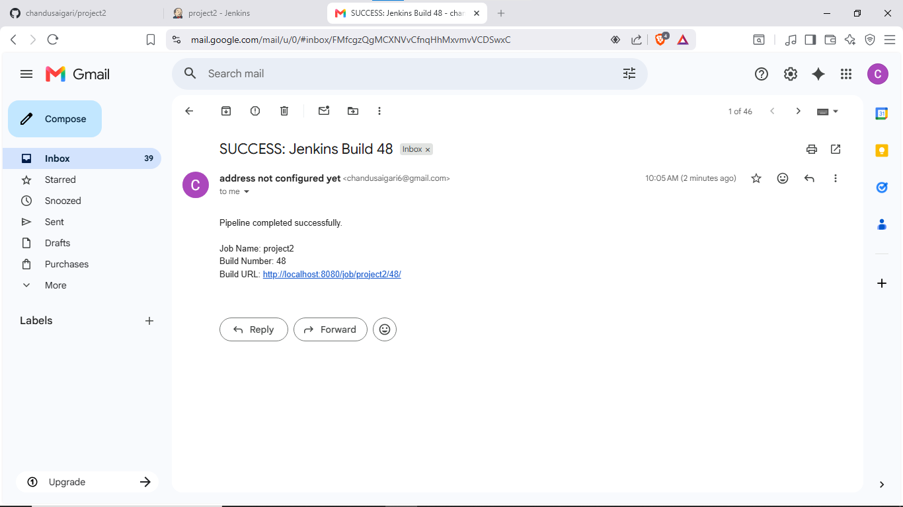

<h2>Docker Hub Images</h2>

After a successful Jenkins pipeline execution, the Docker images are automatically pushed to Docker Hub registry.

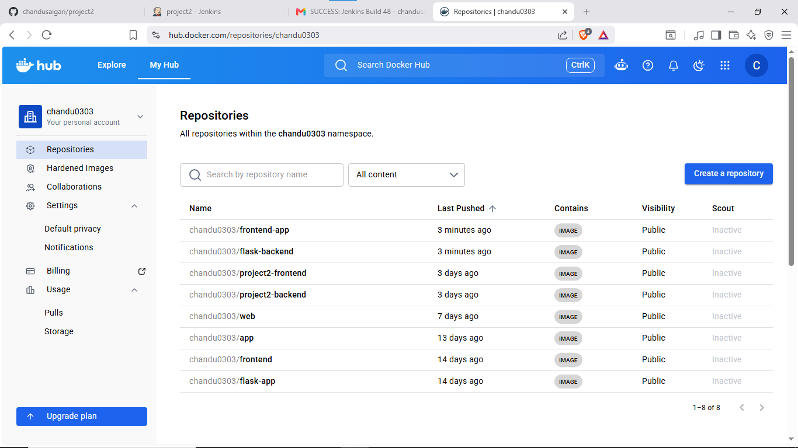

<h2>Kind Cluster Setup (Kubernetes)</h2>

Kind is used to create a local Kubernetes cluster for testing and deployment of the application.

<pre>
kind create cluster --name calculator-cluster
kubectl get nodes
</pre>

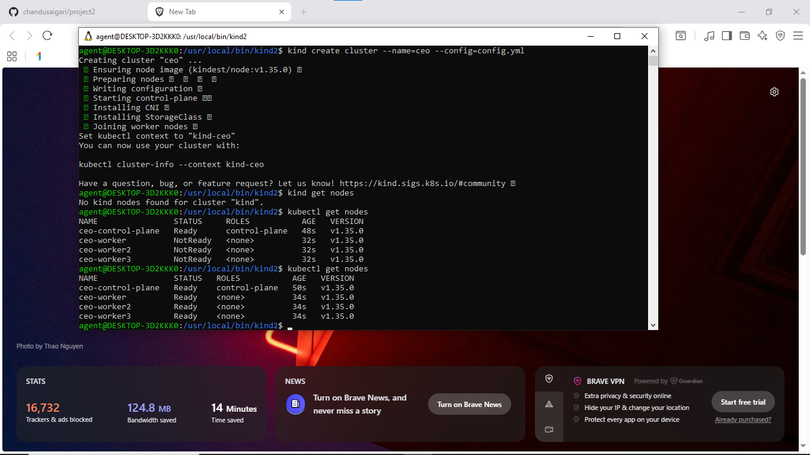

<h2>Namespace Creation</h2>

<pre>
kubectl apply -f ns.yaml
kubectl get namespaces
</pre>

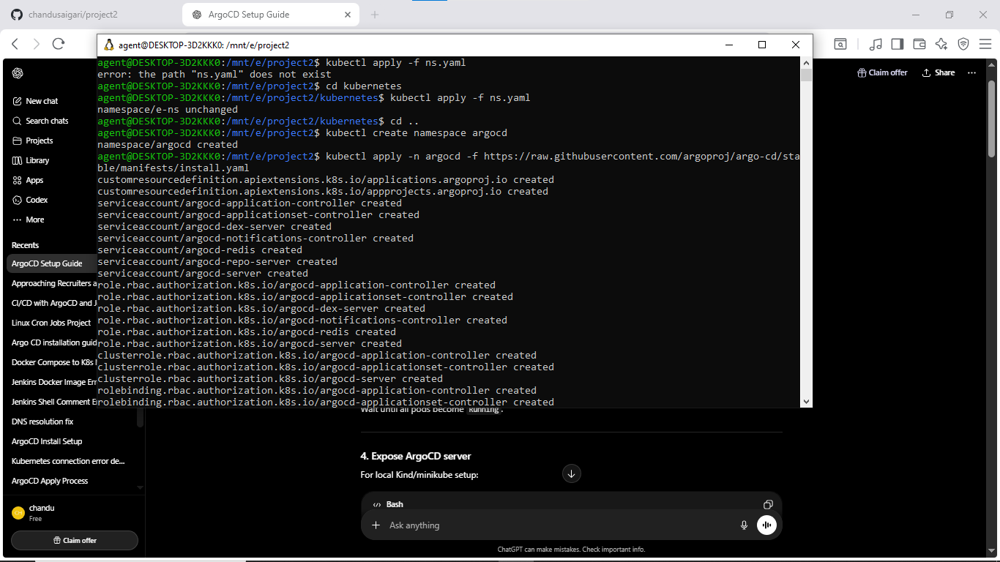

<h2>Argo CD Setup</h2>

<pre>
kubectl create namespace argocd
kubectl apply -n argocd -f https://raw.githubusercontent.com/argoproj/argo-cd/stable/manifests/install.yaml
kubectl get pods -n argocd
kubectl get pods -n argocd -w
</pre>

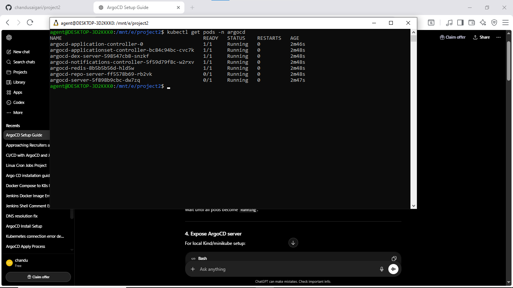

<h2>Port Forwarding</h2>

<pre>
kubectl port-forward svc/argocd-server -n argocd 8081:443
https://localhost:8081

kubectl port-forward svc/backend-service -n calculator 5000:5000
http://localhost:5000

kubectl port-forward svc/frontend-service -n calculator 3000:80
http://localhost:3000

kubectl port-forward svc/mysql-service -n calculator 3306:3306
localhost:3306
</pre>

you can check application running by opening localhost:3000 in browser

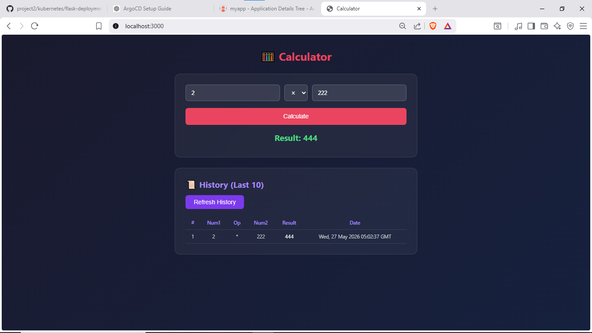

<h2>before and after changes in argocd </h2>
<pre>you can see here below is only one replicaset for backend service</pre>
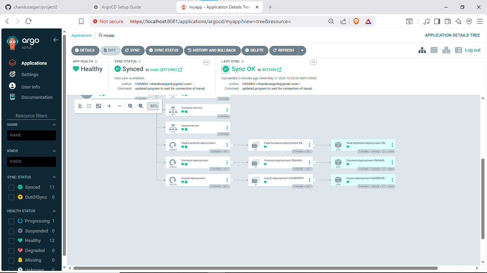
<pre>But after changes in github replicaset there are 3 replicas triggered by argocd</pre>

<h2>MySQL Data Verification</h2>

<pre>
kubectl exec -it &lt;mysql-pod-name&gt; -n e-ns -- mysql -u root -p

SHOW DATABASES;
USE appdb;
SHOW TABLES;
SELECT * FROM calculations;
</pre>

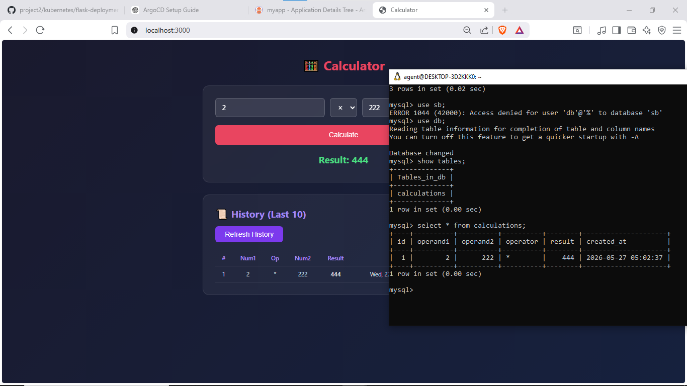
